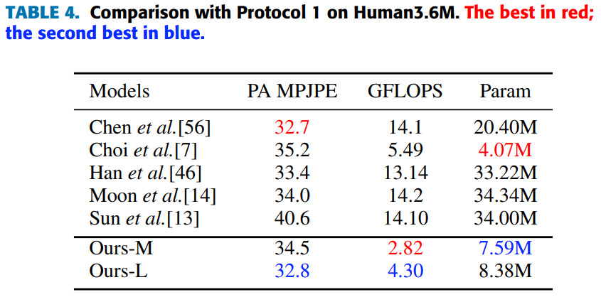
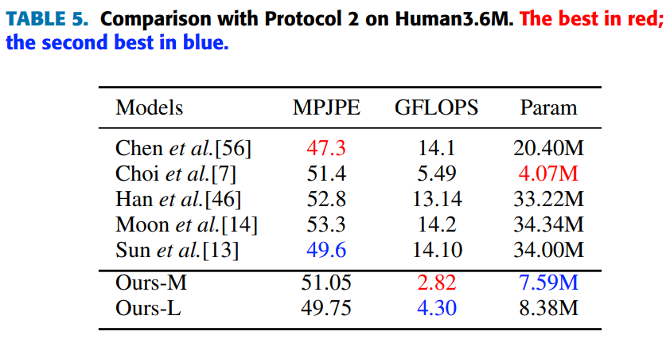

# ConvNeXtPose

## Introduction

This repo is official **[PyTorch](https://pytorch.org)** implementation of **[ConvNeXtPose: A Fast Accurate Method for 3D Human Pose Estimation and its AR Fitness Application in Mobile Devices(IEEE Access 2023)]()**.

## Dependencies
* [PyTorch](https://pytorch.org)
* [CUDA](https://developer.nvidia.com/cuda-downloads)
* [cuDNN](https://developer.nvidia.com/cudnn)
* [COCO API](https://github.com/cocodataset/cocoapi)

This code is tested under Ubuntu 20.04, CUDA 11.6, cuDNN 8.4.1 environment with single NVIDIA RTX 3090Ti GPUs.

Python 3.8.10 version is used for development.

## Directory

### Root
The `${ROOT}` is described as below.
```
${ROOT}
|-- data
|-- demo
|-- common
|-- main
|-- tool
|-- vis
`-- output
```
* `data` contains data loading codes and soft links to images and annotations directories.
* `demo` contains demo codes.
* `common` contains kernel codes for 3d multi-person pose estimation system.
* `main` contains high-level codes for training or testing the network.
* `tool` contains data pre-processing codes. You don't have to run this code. I provide pre-processed data below.
* `vis` contains scripts for 3d visualization.
* `output` contains log, trained models, visualized outputs, and test result.

### Data
You need to follow directory structure of the `data` as below.
```
${ROOT}
|-- data
|   |-- Human36M
|   |   |-- bbox_root
|   |   |   |-- bbox_root_human36m_output.json
|   |   |-- images
|   |   |-- annotations
|   |-- MPII
|   |   |-- images
|   |   |-- annotations
|   |-- MSCOCO
|   |   |-- bbox_root
|   |   |   |-- bbox_root_coco_output.json
|   |   |-- images
|   |   |   |-- train2017
|   |   |   |-- val2017
|   |   |-- annotations
|   |-- MuCo
|   |   |-- data
|   |   |   |-- augmented_set
|   |   |   |-- unaugmented_set
|   |   |   |-- MuCo-3DHP.json
|   |-- MuPoTS
|   |   |-- bbox_root
|   |   |   |-- bbox_mupots_output.json
|   |   |-- data
|   |   |   |-- MultiPersonTestSet
|   |   |   |-- MuPoTS-3D.json
```
* Download Human3.6M parsed data [[data](https://drive.google.com/drive/folders/1r0B9I3XxIIW_jsXjYinDpL6NFcxTZart?usp=sharing)]
* Download MPII parsed data [[images](http://human-pose.mpi-inf.mpg.de/)][[annotations](https://drive.google.com/drive/folders/1rrL_RxhwQgwhq5BU1iIRPwl285B_KTpU?usp=sharing)]
* Download MuCo parsed and composited data [[data](https://drive.google.com/drive/folders/1dfhFa1kBHYKLTKuprNc7xixt3yyKEky5?usp=sharing)]
* Download MuPoTS parsed data [[images](http://gvv.mpi-inf.mpg.de/projects/SingleShotMultiPerson/)][[annotations](https://drive.google.com/file/d/1wZ_QdqDzYqz1Lh4Yqf_-dSC568CFnfA0/view?usp=sharing)]
* All annotation files follow [MS COCO format](http://cocodataset.org/#format-data).
* If you want to add your own dataset, you have to convert it to [MS COCO format](http://cocodataset.org/#format-data).

To download multiple files from Google drive without compressing them, try [this](https://chrome.google.com/webstore/detail/drive-multiple-downloader/baolodbihgboogdhkikimhadihambecp).
If you have a problem with 'Download limit' problem when tried to download dataset from google drive link, please try this trick.  
```  
* Go the shared folder, which contains files you want to copy to your drive  
* Select all the files you want to copy  
* In the upper right corner click on three vertical dots and select “make a copy”  
* Then, the file is copied to your personal google drive account. You can download it from your personal account.  
```  

### Output
You need to follow the directory structure of the `output` folder as below.
```
${ROOT}
|-- output
|-- |-- log
|-- |-- model_dump
|-- |-- result
`-- |-- vis
```
* Creating `output` folder as soft link form is recommended instead of folder form because it would take large storage capacity.
* `log` folder contains training log file.
* `model_dump` folder contains saved checkpoints for each epoch.
* `result` folder contains final estimation files generated in the testing stage.
* `vis` folder contains visualized results.

### 3D visualization
* Run `$DB_NAME_img_name.py` to get image file names in `.txt` format.
* Place your test result files (`preds_2d_kpt_$DB_NAME.mat`, `preds_3d_kpt_$DB_NAME.mat`) in `single` or `multi` folder.
* Run `draw_3Dpose_$DB_NAME.m`

## Running ConvNeXtPose
### Start
* In the `main/config.py`, you can change settings of the model including dataset to use, network backbone, and input size and so on.

### Train
In the `main` folder, run
```bash
python train.py --gpu 0-1
```
to train the network on the GPU 0,1. 

If you want to continue experiment, run 
```bash
python train.py --gpu 0-1 --continue
```
`--gpu 0,1` can be used instead of `--gpu 0-1`.

### Test
Place trained model at the `output/model_dump/`.

In the `main` folder, run 
```bash
python test.py --gpu 0-1 --test_epoch 20-21
```
to test the network on the GPU 0,1 with 20th and 21th epoch trained model. `--gpu 0,1` can be used instead of `--gpu 0-1`.

## Results
Here I report the performance of the ConvNeXtPose. 
* Download pre-trained models of the ConvNeXtPose in [here](https://drive.google.com/drive/folders/1El3qfdtgttO90X25k_680V2UCDv_TPoJ?usp=sharing) 

#### Human3.6M dataset using protocol 1
For the evaluation, you can run `test.py` or there are evaluation codes in `Human36M`.
<p align="center">

</p>

#### Human3.6M dataset using protocol 2
For the evaluation, you can run `test.py` or there are evaluation codes in `Human36M`.
<p align="center">

</p>

## Acknowledgement
Part of our code is borrowed from **[PoseNet](https://github.com/mks0601/3DMPPE_POSENET_RELEASE)**. We thank the authors for releasing the codes.
## Reference
**Data:**
* Compatibility for most of the publicly available 2D and 3D, single and multi-person pose estimation datasets including **[Human3.6M](http://vision.imar.ro/human3.6m/description.php), [MPII](http://human-pose.mpi-inf.mpg.de/), [MS COCO 2017](http://cocodataset.org/#home), [MuCo-3DHP](http://gvv.mpi-inf.mpg.de/projects/SingleShotMultiPerson/) and [MuPoTS-3D](http://gvv.mpi-inf.mpg.de/projects/SingleShotMultiPerson/)**.
  ```
```


